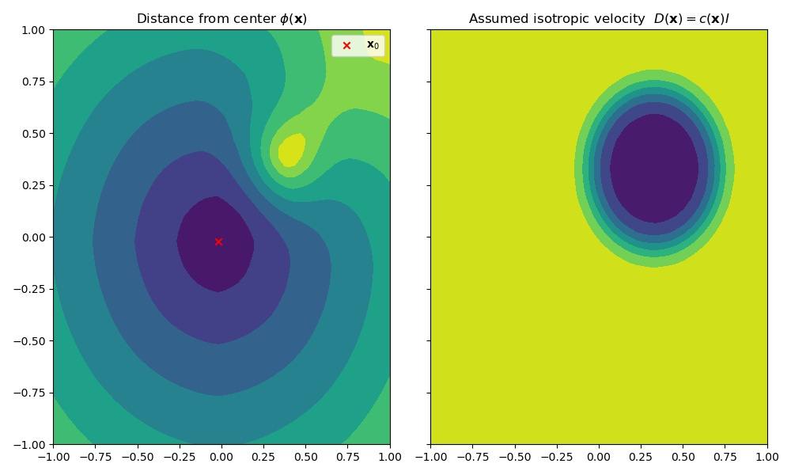
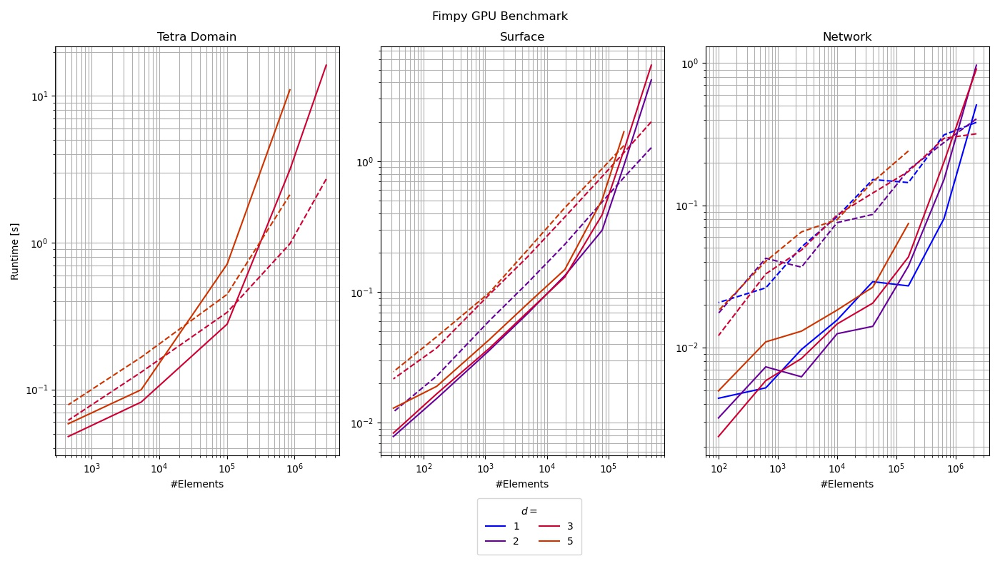
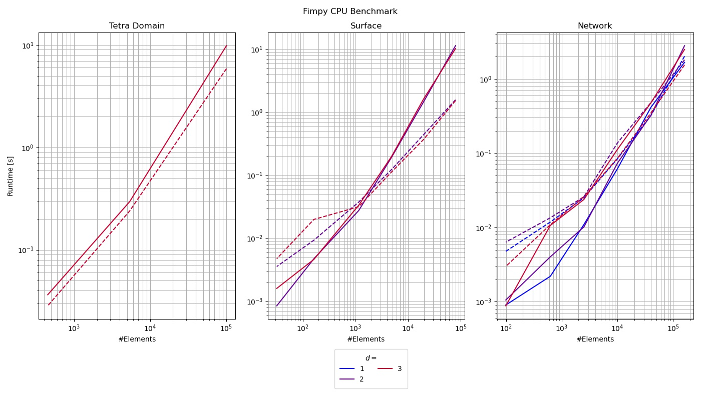

# Fast Iterative Method - Numpy/Cupy
This repository implements the Fast Iterative Method on [tetrahedral domains](https://epubs.siam.org/doi/abs/10.1137/120881956) and [triangulated surfaces](https://epubs.siam.org/doi/abs/10.1137/100788951) purely in python both for CPU (numpy) and GPU (cupy). The main focus is however on the GPU implementation, since it can be better exploited for very large domains.

[](https://codecov.io/gh/thomgrand/fim-python)
[](https://github.com/thomgrand/fim-python/actions/workflows/python-package.yml)

# Details
The anisotropic eikonal equation, given by


for given boundary conditions 

%20=%20g(\mathbf{x}_0))

For a given anisotropic velocity, this can calculate the geodesic distance between a set of  and all points on the domain like shown in the figure.



Note that when using multiple , they are not guaranteed to be in the final solution if they are not a valid viscosity solution. A recommended read for more details on the subject is:  
Evans, Lawrence C. "Partial differential equations." *Graduate studies in mathematics* 19.2 (1998).

# Installation

The easiest way to install the library is using pip
```bash
pip install fim-python[gpu] #GPU version
```

If you don't have a compatible CUDA GPU, you can install the CPU only version to test the library, but the performance won't be comparable to the GPU version (see [Benchmark](#Benchmark)).

```bash
pip install fim-python #CPU version
```

# Usage

A general rule of thumb: If you only need to evaluate the eikonal equation once for a mesh, the Jacobi version will probably be quicker since its initial overhead is low.
Repeated evaluations with different  or  favor the active list method for larger meshes.  
On the CPU, the AL method outperforms the Jacobi approach for almost all cases.

```python
fim_np = FIMNP(points, triangs, D, precision=np.float32) #CPU Jacobi
result = fim_np.comp_fim(x0, x0_vals)

fim_np_al = FIMNPAL(points, triangs, D, precision=np.float32) #CPU w. active list
result_al = fim_np_al.comp_fim(x0, x0_vals)

fim_cp = FIMCupy(points, triangs, D, precision=np.float32) #GPU Jacobi
result_cp = fim_cp.comp_fim(x0, x0_vals)

fim_cp_al = FIMCupy(points, triangs, D, precision=np.float32) #GPU w. active list
result_cp_al = fim_cp.comp_fim(x0, x0_vals)
```

# Documentation

[https://fim-python.readthedocs.io/en/latest](https://fim-python.readthedocs.io/en/latest)

# Benchmark

Below you can see a performance benchmark of the library for tetrahedral domains (cube in ND), triangular surfaces (plane in ND), and line networks (randomly sampled point cloud in the ND cube with successive minimum spanning tree) from left to right.
In all cases,  was placed in the middle of the domain.
The dashed lines show the performance of the implementation using active lists, the solid lines use the Jacobi method (computing all updates in each iteration).





The library works for an arbitrary number of dimensions (manifolds in N-D), but the versions for 2 and 3D received a few optimized kernels that speed up the computations.

# License

This library is licensed under the [GNU Affero General Public License](LICENSE). 
If you need the library issued under another license for commercial use, you can contact me via e-mail [tomdev (at) gmx.net](mailto:tomdev@gmx.net).
